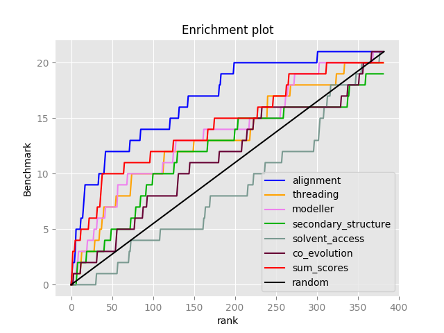

[](https://github.com/meetU-MasterStudents/Fold_U/releases/tag/v1.2)
[](https://opensource.org/licenses/MIT)

[](https://fold-u.readthedocs.io/en/latest/?badge=latest)

<br>

# Fold U: A Protein Structure Prediction Program

<p align="center">
  
</p>

This program is the second step (downstream) of a **protein structure prediction project**. This step consists of threading a query sequence on different given templates.


Our project is part of the **Meet-U 2018-2019** competition.
Meet-U is a collaborative pedagogical and research initiative between several Universities of Paris area. The course is intended to Master students (2nd year) in Bioinformatics. For more details, please refer to [http://www.meet-u.org/](http://www.meet-u.org/).

## Implemented Strategy

The overall strategy implemented by our team is the following :
1. The `.foldrec` file resulting from a profile-profile alignment and generated during the first step (upstream) is parsed to extract relevant informations (query and template sequences, alignment score, etc.).
2. For each alignment, **the query sequence is threaded on the template** and a **threading score** is generated using an energy DOPE matrix.
3. Then, the program **MODELLER** generates a new 3D model by homology (alignment between query and template) and returns a high resolution (bin 0.125Å) DOPE score, which is a statistical potential implemented in MODELLER.
This new model is then used to calculate several other scores (**secondary structure**, **solvent accessibility** and **co-evolution scores**).
4. Each generated scores are **normalized using the min-max scaling method** (values between 0 and 1) in order to addition them.
5. The scores are stored in `scores.csv` and the **top N pdb structure** are generated.

### Implemented scores

To improve the structure prediction of the query, several scores have been implemented :
- **Alignment score** : Resulting from the profile-profile alignment during the first step (Upstream).
- **Threading score** : Score based on the threading of the query on the template and the energy DOPE matrix.
- **Modeller score** : Calculating the DOPE statistical potential score of the new model generated by homology modelling with MODELLER based on the alignment of the query and the template.
- **Co-evolution score** : Co-evolution score measures co-occurence of a pair of amino acid in ortholog sequences using CCMpred program.
- **Secondary structure score** : Based on the predicted secondary structure and associated confidence score generated by PSIPRED, query and template are compared and a score is generated.
- **Solvent accessibility score** : DSSP generates a solvent accessibility value for each amino acid of
the template and the new template generated by Modeller. Those two values are compared and a solvent accessibility score is generated.
- **Blosum score** : Comparing amino acid sequence between the query and the template and generating a score based on the blosum62 matrix. This score is not used in the sum score because of its lack of prediction.
- **Sum score** : The addition of all previously mentionned scores (without the blosum score)

### Benchmarking

This program is also **benchmarked** using ROC style plots and **Top N** information to evaluate the power and the relevance of the different scores. The score results are generated for all queries (foldrec files). Each plot represents the cumulative sum of benchmarks encountered along the ranking (from rank 1 to rank 405) for each calculated scores and for a specific benchmark type (**"Family"**, **"Superfamily"** or **"Fold"**) which correspond to the degree of similarity with the query.

A top N results table is also generated showing the number of **"Family"**, **"Superfamily"** and **"Fold"** benchmark found in the top N ranks.

We used the **new data** and the **new benchmark.list**.


## Installation

### Clone the repository
```
git clone https://github.com/meetU-MasterStudents/Fold_U.git
cd Fold_U
```

### Requirements
Install the few required packages / modules :
```
pip install -r requirements.txt
```

**MODELLER** is also required, and can be installed easily with Conda :
```
conda install -c salilab modeller
```
You need to register to get a license key [here](https://salilab.org/modeller/registration.html), and follow instructions during installation to insert license key in the program.


To calculate the solvent accessibility score **DSSP** is also required:
```
sudo apt-get install dssp
```
Or you can download the [latest release](https://github.com/cmbi/xssp/releases/latest) and install from source.

In order to gain time, we have already **run CCMpred** with all the multiple alignment files to create the multiple alignment files in `.clustal` format and the `.mat` files with the following script :

```
./script/run_ccmpred.py
```

## Run the program

`fold_u` takes in input a **foldrec file** and a **multiple alignment file** (fasta format). It returns a `score.csv` file and the **top N pdb structures**.

### Toy example

The `scores.csv` and the **top 10 pdb structures** of the His_biosynth query sequence are stored in `results/His_biosynth` folder.
```
./fold_u data/foldrec/His_biosynth.foldrec data/aln/clustal/His_biosynth.clustal\
         data/ccmpred/His_biosynth.mat -o results/His_biosynth
```

#### Get help

```
./fold_u -h

Usage:
      ./fold_u FOLDREC CLUSTAL CCMPRED [--nb_pdb NUM] [--output PATH] [--dssp PATH] [--cpu NUM]
                                       [--metafold PATH] [--dope PATH] [--benchmark PATH]

Arguments:
    FOLDREC                               N profile * profile alignment and
                                          their corresponding score.
    CLUSTAL                               Path to the multiple alignment file (clustal format).
    CCMPRED                               Path to the ccmpred result file.

Options:
    -h, --help                            Show this
    -p NUM, --nb_pdb NUM                  Number of pdb to create
                                          [default: 10]
    -o PATH, --output PATH                Path to the directory containing
                                          the result files (scores and pdb)
                                          [default: ./results]
    -a PATH, --dssp PATH                  Path to the dssp software
                                          binary [default: /usr/bin/mkdssp]
    -c NUM, --cpu NUM                     Number of cpus to use for parallelisation. By default
                                          using all available (0).
                                          [default: 0]
    -m PATH, --metafold PATH              Path to the metafold.list file
                                          [default: data/metafold.list]
    -d PATH, --dope PATH                  Path to the dope.par file
                                          [default: data/dope.par]
    -b PATH, --benchmark PATH             Path to the benchmark.list file
                                          [default: data/benchmark.list]
```
### Run all the queries + Benchmarking

`script/benchmarking.py` runs the `fold_u` program for each foldrec if results are not still generated. It returns a `results/plots` folder containing the generated plots and prints the **top N tables** in the terminal.

```
./script/benchmarking.py
```

#### Get help

```
./script/benchmarking.py -h

Usage:
    ./script/benchmarking.py [--selected_score SCORE] [--dssp PATH] [--cpu NUM] [--output PATH]   

Options:
    -h, --help                            Show this
    -s SCORE, --selected_score SCORE      Score for which you wish to see the statistics:
                                          "alignment", "threading", "modeller",
                                          "secondary_structure", "solvent_access"
                                          or "sum_scores",
                                          or all of them at once: "all" [default: all]
    -d PATH, --dssp PATH                  Path to the dssp software
                                          binary [default: /usr/local/bin/mkdssp]
    -c NUM, --cpu NUM                     Number of cpus to use for parallelisation. By default
                                          using all available (0).
                                          [default: 0]
    -o PATH, --output PATH                Path to the directory containing
                                          the result files (scores and plot)
                                          [default: ./results/plots]
```

### Results

**! We used the new data !**

#### Top N tables
```
Table summarizing the top N results.

          Family    Superfamily   Fold       Total

top 5     0/1       1/6           2/13       3/20
          0.0  %    16.7 %        15.4 %     15.0 %
-----------------------------------------------------
top 10    0/1       2/6           2/13       4/20
          0.0  %    33.3 %        15.4 %     20.0 %
-----------------------------------------------------
top 15    0/1       3/6           2/13       5/20
          0.0  %    50.0 %        15.4 %     25.0 %
-----------------------------------------------------
top 20    0/1       3/6           2/13       5/20
          0.0  %    50.0 %        15.4 %     25.0 %
-----------------------------------------------------
top 25    0/1       3/6           3/13       6/20
          0.0  %    50.0 %        23.1 %     30.0 %
-----------------------------------------------------
top 50    0/1       4/6           6/13       10/20
          0.0  %    66.7 %        46.2 %     50.0 %
-----------------------------------------------------
top 75    0/1       4/6           7/13       11/20
          0.0  %    66.7 %        53.8 %     55.0 %
-----------------------------------------------------
top 100   0/1       4/6           8/13       12/20
          0.0  %    66.7 %        61.5 %     60.0 %
-----------------------------------------------------
top 150   0/1       5/6           8/13       13/20
          0.0  %    83.3 %        61.5 %     65.0 %
-----------------------------------------------------
top 200   0/1       5/6           10/13      15/20
          0.0  %    83.3 %        76.9 %     75.0 %
-----------------------------------------------------
top 250   0/1       6/6           11/13      17/20
          0.0  %    100.0%        84.6 %     85.0 %
-----------------------------------------------------
top 300   0/1       6/6           13/13      19/20
          0.0  %    100.0%        100.0%     95.0 %
-----------------------------------------------------
top 350   1/1       6/6           13/13      20/20
          100.0%    100.0%        100.0%     100.0%
-----------------------------------------------------

```


#### Generated plot
<p align="center">
  
</p>


## Documentation

The documentation of our program is generated with Sphinx and and built on [Read The Docs](https://fold-u.readthedocs.io/en/latest/?badge=latest).

## Authors

We are master students in bioinformatics at Paris Diderot University.
- [Franz-Arnold Ake](https://github.com/franzx5)
- [Gabriel Cretin](https://github.com/gabrielctn)
- [Tom Gutman](https://github.com/tomgutman)
- [Hélène Kabbech](https://github.com/kabhel)
- [Flora Mikaeloff](https://github.com/FloraMika)


## Acknowledgment

Thanks to [Maïté Cretin](https://www.linkedin.com/in/maitewho/) for the nice logo.

Thanks to team 1 and team 2 for generating to us multiple alignment files (`data/aln`).

## License

This project is licensed under the MIT License.
