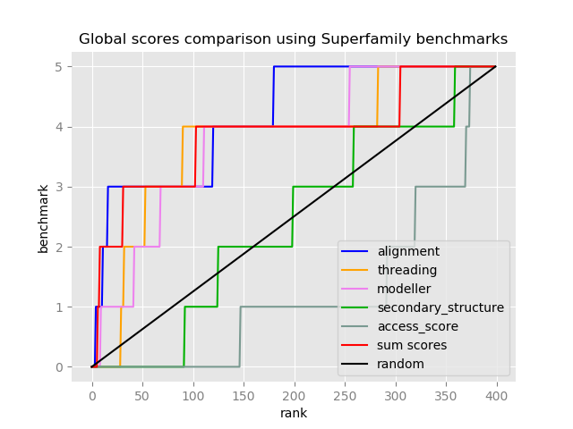
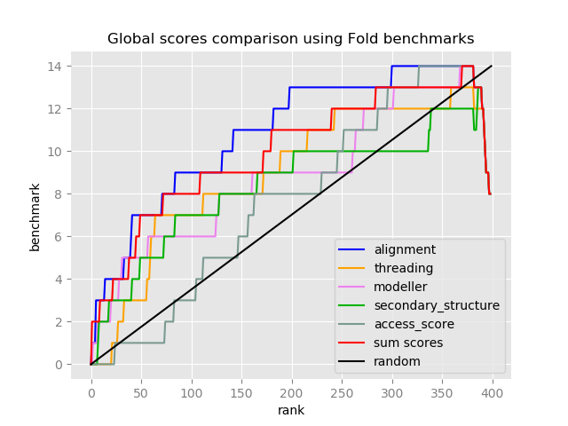

[](https://github.com/meetU-MasterStudents/Fold_U/releases/tag/v1.2)
[](https://opensource.org/licenses/MIT)

[](https://fold-u.readthedocs.io/en/latest/?badge=latest)

<br>

# Fold U: A Protein Structure Prediction Program

<p align="center">
  
</p>

This program is the second step (downstream) of a protein structure prediction project. This step consists of threading a query sequence on different given templates.


Our project is part of the Meet-U 2018-2019 competition.
Meet-U is a collaborative pedagogical and research initiative between several Universities of Paris area. The course is intended to Master students (2nd year) in Bioinformatics. For more details, please refer to [http://www.meet-u.org/](http://www.meet-u.org/).

The overall strategy implemented is the following. The input file is generated during the
first step (upstream team). This is a .foldrec file resulting from a profile-profile
alignment. This foldrec file is parsed to extract the different information like the
query and template sequences and the alignment score associated.  Then a threading step
generating a threading score is performed using a DOPE matrix file. For each alignment
from the .foldrec file, Modeller predicts a secondary structure by homology and generates
a score and a new template pdb file which is then used to calculate several scores (secondary structure, solvent accessibility and co-evolution scores). Scores are then normalized using min-max
algorithm and a reranking of the templates is performed.

This program is also benchmarked using ROC style plots and Top N information to evaluate
the power and the relevance of our proram.

## Installation

### Clone the repository
```
git clone https://github.com/meetU-MasterStudents/Fold_U.git
cd Fold_U
```

### Requirements
Install the few required packages / modules:
```
pip install -r requirements.txt
```

MODELLER is also required, and can be installed easily with Conda:
```
conda install -c salilab modeller
```
You need to register to get a license key [here](https://salilab.org/modeller/registration.html), and follow instructions during installation to insert license key in the program.


To calculate the solvent accessibility score DSSP is also required:
```
sudo apt-get install dssp
```
Or you can download the [latest release](https://github.com/cmbi/xssp/releases/latest) and install from source.

## Run the program
`fold_u` takes in input **N profil-profil alignments and their corresponding score** (foldrec file) and returns a `score.csv` file and the **top N pdb structures**.

### Toy example

The `scores.csv` and the **top 10 pdb structures** of the His_biosynth query sequence are stored in `results/His_biosynth` folder.
The alignment, threading and blosum_scores are normalized using the **min-max scaling method** (values between 0 and 1). The last score represents the sum of these 3 scores. It has also been normalized.
```
./fold_u data/foldrec/His_biosynth.foldrec -o results/His_biosynth
```
### Scores

To improve the structure prediction of the query, several scores have been implemented:
- **alignment score** : resulting from the profile -profile alignment
- **threading score** : score based on the DOPE matrix
- **modeller scores** :
- **secondary structure score** :
- **solvent accessibility score** :
- **sum scores** : the addition of all previously mentionned scores

### Benchmarking

The score results are generated for each query (foldrec file). Each plot represents the cumulative sum of benchmarks encountered along the ranking (from rank 1 to rank 405) for each calculated scores and for a specific benchmark type ("Family", "Superfamily" or "Fold") which correspond to the degree of similarity with the query.
```
./script/benchmarking.py
```

<p align="center">
  
  
  
</p>

### Get help
```
./fold_u -h

    Usage:
        ./fold_u FOLDREC_FILE [--nb_templates NUM] [--nb_pdb NUM] [--output PATH]
                              [--metafold FILE] [--dope FILE] [--benchmark FILE] [--cpu NUM]

    Arguments:
        FOLDREC_FILE                          N profile * profile alignment and
                                              their corresponding score

    Options:
        -h, --help                            Show this
        -n NUM, --nb_templates NUM            First n templates to retrieve from
                                              the foldrec file [default: 413]
        -p NUM, --nb_pdb NUM                  Number of pdb to create
                                              [default: 10]
        -o PATH, --output PATH                Path to the directory containing
                                              the result files (scores and pdb)
                                              [default: ./results]
        -m FILE, --metafold FILE              Path to the metafold.list file
                                              [default: data/metafold.list]
        -d FILE, --dope FILE                  Path to the dope.par file
                                              [default: data/dope.par]
        -b FILE, --benchmark FILE             Path to the benchmark.list file
                                              [default: data/benchmark.list]
        -c NUM, --cpu NUM                     Number of cpus to use for parallelisation
                                              [default: 2]
```

## Documentation

The documentation of our program is generated with Sphinx and and built on [Read The Docs](https://fold-u.readthedocs.io/en/latest).

## Authors

We are master students in bioinformatics at Paris Diderot University.
- [Gabriel Cretin](https://github.com/gabrielctn)
- [Hélène Kabbech](https://github.com/kabhel)
- [Tom Gutman](https://github.com/tomgutman)
- [Flora Mikaeloff](https://github.com/FloraMika)
- [Franz-Arnold Ake](https://github.com/franzx5)

## Acknowledgment

Thanks to [Maïté Cretin](https://www.linkedin.com/in/maitewho/) for the nice logo.
And thanks to team 1 and team 2 for generating to us multiple alignment files (data/aln)

## License

This project is licensed under the MIT License.
